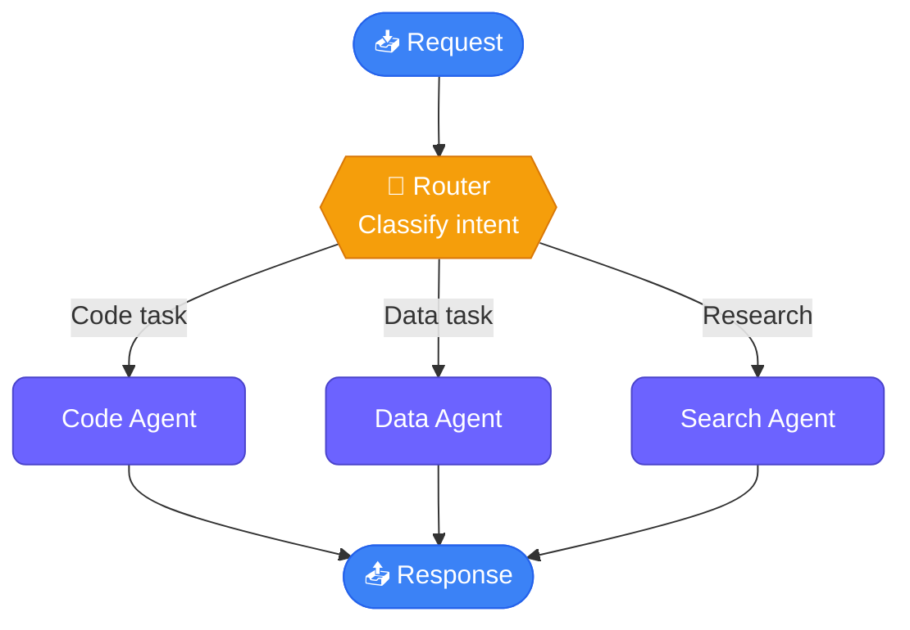
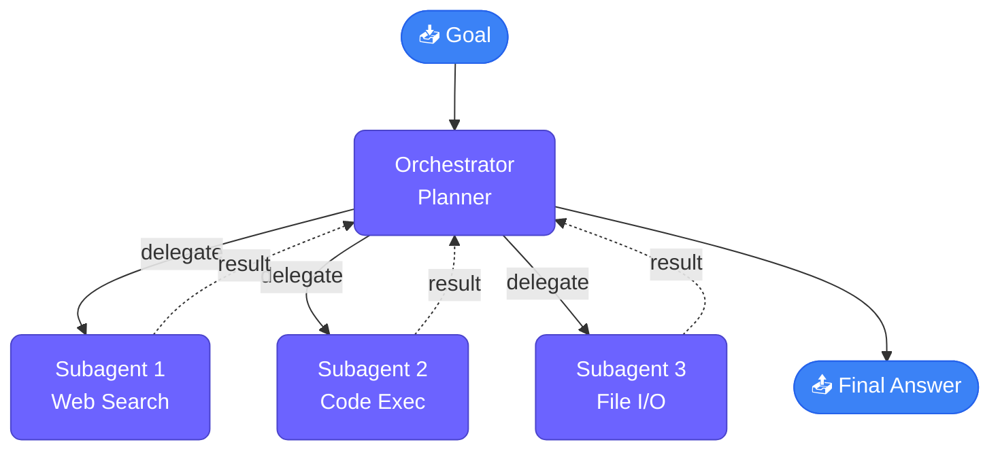
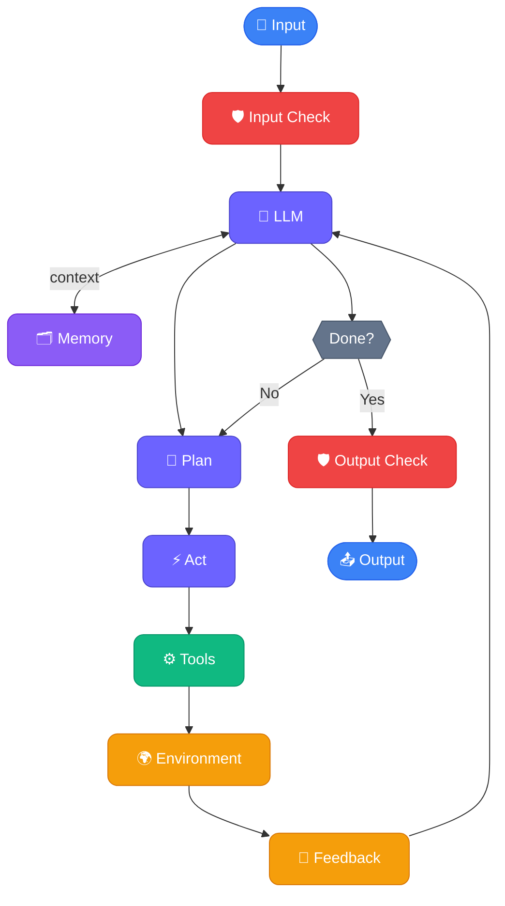
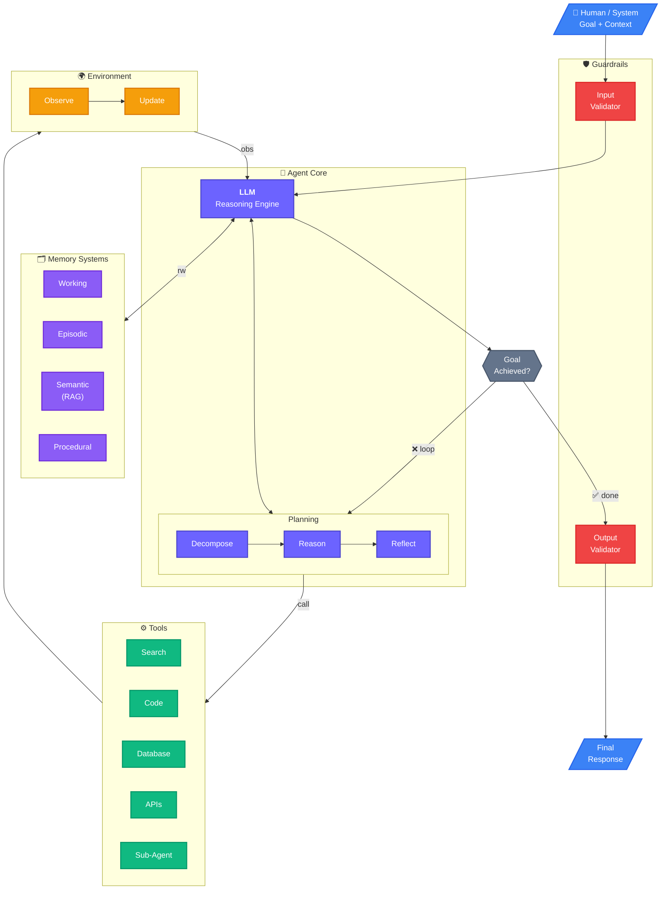

# AI Agents

## Ambiguity on what Agents acutlly are

`AI Agents are programs where LLM outputs control the workflow`

In prectice, describes an AI solution that involes any or all of these:

1. Multiple LLM calls
2. LLMs with ability to use Tools
3. An environment where LLMs intract
4. A Planner to coordinte activities
5. Autonomy

## Agentic Systems

Anthroic distinguishes two types:

- Workflows: are systems where LLMs and tools are orchestrated through predefined code paths 
- Agents: are systems where LLMs dynamically direct their own processes and tool usage, maintaining control over how they accomplish tasks

### 5 workflow design patterns

1. Prompt Chaining (Sequential Pipeline)

2. Parallelization (Fan-Out / Fan-In)

3. Routing (Conditional Dispatch)

4. Orchestrator–Worker (Subagents / Tool Use)

5. Evaluator–Optimizer (Reflection Loop)

### Agents:

Open-ended, Feedback loops, No Fixed path

Risks of Agents Frameworks: Unpredicatable path, Unpredicatable output, Unpredictable costs, Monitor

`Guardrails ensure your agents behave safely, consistently, and within your intended boundaries`

## The cast of characters

- OpenAI: gpt-4o-mini(also gpt-4o, o1, o3-mini)
- Anthropic: Claude-3-7-Sonnet
- Google: Gemini-2.0-flash
- DeepSeek AI: DeepSeek V3, DeepSeek R1
- Groq: open-source LLMs including Llama3.3
- Ollama: local open-source LLMs including LLama3.2

https://www.vellum.ai/llm-leaderboard