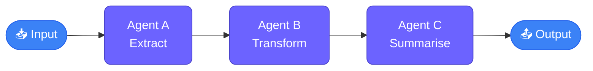
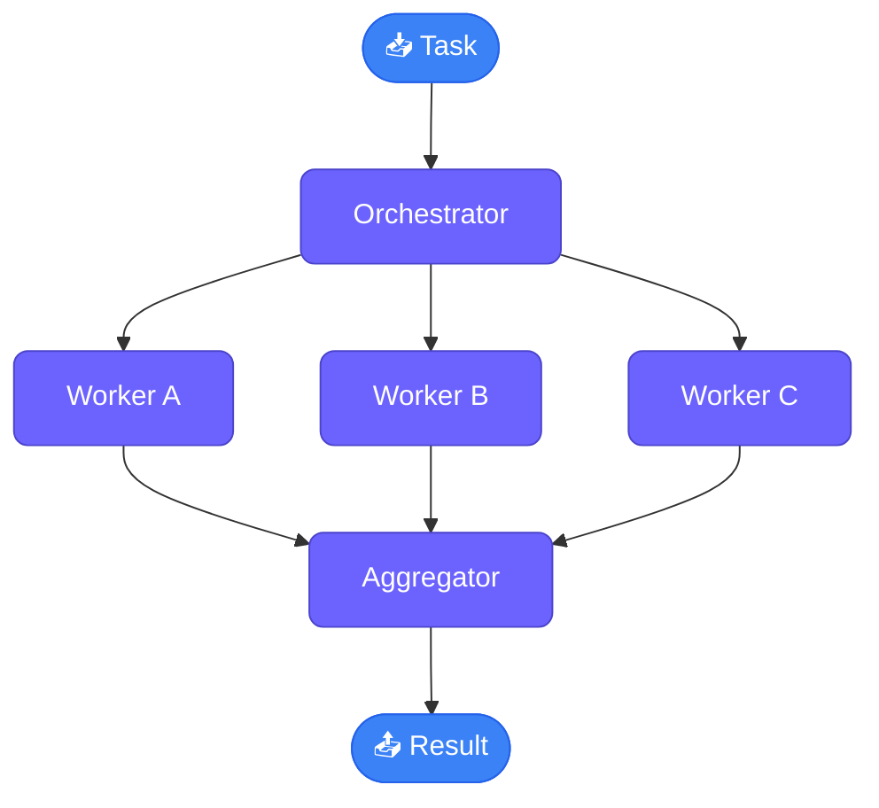
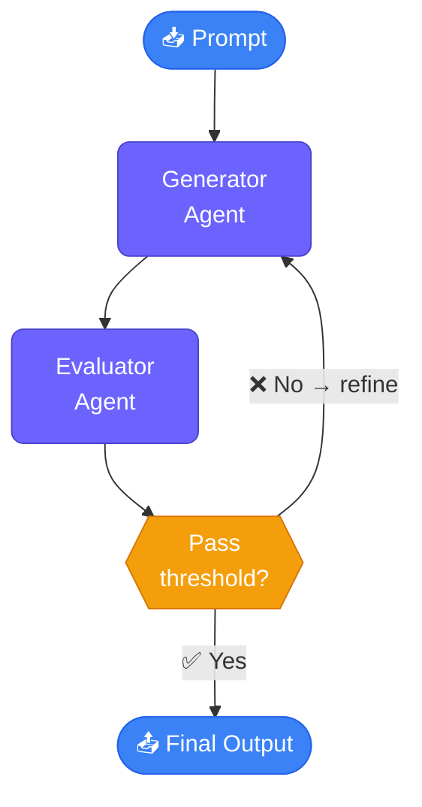
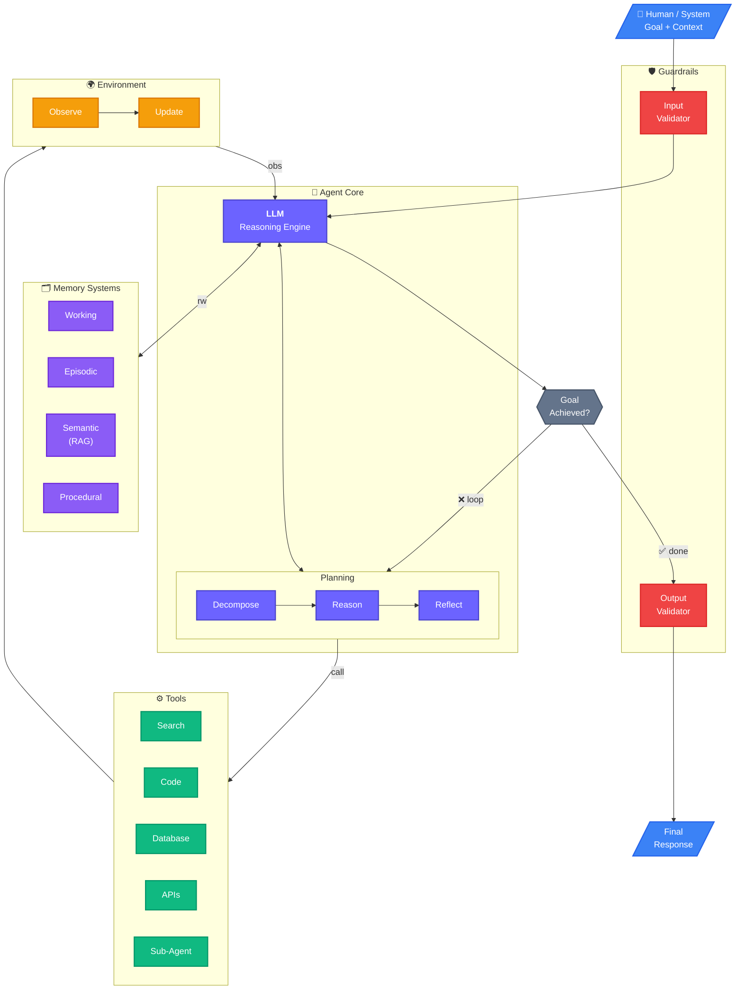

# AI Agents

## Ambiguity on what Agents acutlly are

`AI Agents are programs where LLM outputs control the workflow`

In practice, describes an AI solution that involes any or all of these:

1. Multiple LLM calls
2. LLMs with ability to use Tools
3. An environment where LLMs intract
4. A Planner to coordinte activities
5. Autonomy


## Agentic Systems

Anthroic distinguishes two types:

- Workflows: are systems where LLMs and tools are orchestrated through predefined code paths 
- Agents: are systems where LLMs dynamically direct their own processes and tool usage, maintaining control over how they accomplish tasks

### 5 workflow design patterns


1. Prompt Chaining (Sequential Pipeline)




2. Parallelization (Fan-Out / Fan-In)




3. Routing (Conditional Dispatch)


4. Orchestrator–Worker (Subagents / Tool Use)


5. Evaluator–Optimizer (Reflection Loop)




### Agents:

Open-ended, Feedback loops, No Fixed path

Risks of Agents Frameworks: Unpredicatable path, Unpredicatable output, Unpredictable costs, Monitor

`Guardrails ensure your agents behave safely, consistently, and within your intended boundaries`




## The cast of characters

- OpenAI: gpt-4o-mini(also gpt-4o, o1, o3-mini)
- Anthropic: Claude-3-7-Sonnet
- Google: Gemini-2.0-flash
- DeepSeek AI: DeepSeek V3, DeepSeek R1
- Groq: open-source LLMs including Llama3.3
- Ollama: local open-source LLMs including LLama3.2

https://www.vellum.ai/llm-leaderboard


## Agentic AI Frameworks

```txt
                ↑ More Abstraction / Power / Complexity
                │
        ┌───────────────────────────────┐
        │   LangGraph / AutoGen         │
        │   (Graph + Multi-Agent OS)    │
        └───────────────────────────────┘
                │
        ┌───────────────────────────────┐
        │   LangChain / LlamaIndex      │
        │   (Pipelines + RAG Systems)   │
        └───────────────────────────────┘
                │
        ┌───────────────────────────────┐
        │ OpenAI Agents SDK / CrewAI    │
        │ (Lightweight Agents)          │
        └───────────────────────────────┘
                │
        ┌───────────────────────────────┐
        │     MCP (Protocol Layer)      │
        │ (Standardized Tool/Model Conn)│
        └───────────────────────────────┘
                │
        ┌───────────────────────────────┐
        │   Direct API (No Framework)   │
        │   (Max Control, Raw LLMs)     │
        └───────────────────────────────┘
                │
                ↓ More Control / Flexibility
```


## 📚 Resources (Context = Intelligence Boost)

* LLM performance improves with **better context, not just better models**
* Resources = **extra relevant information injected into the prompt**
* Think: *“LLM + Context = Domain Expert”*

### ⚡ Key Points

* Add **domain knowledge** (e.g., pricing, policies, docs)
* Avoid dumping everything → **context must be relevant**
* More context ≠ better → **quality > quantity**
* Context window is limited → optimize usage

### 🧠 Techniques

* **Naive approach** → dump all data into prompt
* **Smart approach → RAG (Retrieval-Augmented Generation)**

  * Retrieve only **relevant chunks**
  * Improves accuracy + reduces cost
  * Core idea: *Search → Inject → Generate*

### 🎯 Use Cases

* Customer support bots
* Internal knowledge assistants
* Document QA systems

---

## 🛠️ Tools (Autonomy = Action Capability)

* Tools = **giving LLM ability to DO things (not just answer)**
* Enables **agent behavior (decision + action loop)**

### ⚡ Key Points

* LLM decides **when to use a tool**
* Tools can be:

  * APIs (weather, payments)
  * DB queries (SQL)
  * Functions (calculator, scripts)
  * Other LLM calls

---

## ⚙️ How Tool Calling *Actually* Works (Demystified)

> ❗ Important interview insight: *“It’s not magic — it’s structured prompting + code”*

### 🔄 Flow

1. You **define tools in prompt**
2. Ask LLM to respond in **structured format (JSON)**
3. LLM replies:

   ```json
   { "action": "get_price", "city": "Paris" }
   ```
4. Your code:

   * Parses response
   * Runs tool (`if/else`)
5. Send result back to LLM
6. LLM generates final answer

---

## 🧠 Mental Model

* **Resources → Makes LLM smarter**
* **Tools → Makes LLM capable**

```
LLM + Resources → Knowledgeable
LLM + Tools → Actionable
LLM + Both → Agent
```

---


Prompt Engineering
System Prompt
User Prompt
Context Injection

Gradio
Pydantic
Prompt conditioning (Pig Latin example)
Callback functions (Gradio)


Evaluator-Optimizer Pattern
Feedback Loop
Retry Mechanism
Structured Outputs (JSON)
Schema Validation
Workflow without Agent Framework (Vanilla coding = writing plain, raw code without using any frameworks or abstractions.)


we used resources to to arm an LLM with information
structured outputs as a way of implementing the evaluator optimizer pattern. And being able to have that interaction go backwards and forwards.
spotted the connection with use of tools there as well
build agentic flows between llms using things like resources and structured output


Here’s a **practical, structured guide to Prompt Engineering**, focused on exactly what you asked: **prompt types + roles like evaluator/agent patterns**.

---

# 🧠 Prompt Engineering Guide (LLM-Focused)

Prompt engineering is the practice of **designing instructions to control LLM behavior, quality, and structure of output**.

Modern LLM apps are basically:

> 🔁 *Prompt + Context + Model = Behavior*

---

# 🧩 1. Types of Prompts

## 🟦 1. System Prompt (MOST IMPORTANT)

### 📌 What it is:

The **highest-level instruction** that defines:

* Role
* Personality
* Rules
* Constraints
* Output style

### 🧠 Think:

> “Who the AI is + how it should behave”

### ✅ Example:

```text
You are a professional career assistant. 
You answer questions based only on the provided LinkedIn profile.
Be concise, factual, and avoid hallucinations.
```

### 💡 Used for:

* Setting persona
* Safety rules
* Response formatting
* Domain restriction

---

## 🟨 2. User Prompt

### 📌 What it is:

The **actual question or task from the user**

### 🧠 Think:

> “What the user wants right now”

### ✅ Example:

```text
What is your greatest achievement?
```

---

## 🟩 3. Assistant Prompt (History)

### 📌 What it is:

Previous model responses stored in conversation

### 🧠 Think:

> “Memory of the chat”

### Example:

```json
{"role": "assistant", "content": "My greatest achievement is building X"}
```

---

## 🟪 4. Developer Prompt (optional newer systems)

Used in some APIs to:

* Override system behavior slightly
* Add app-level instructions

---

# ⚙️ 2. Prompt Roles in LLM Systems

Modern LLM apps are not just “chatbots” — they act as **multi-role systems**

---

## 🎭 1. Generator (Main LLM)

### Role:

👉 Produces answers

### Example:

* GPT-4 answering interview questions
* Resume chatbot

---

## 🧪 2. Evaluator (VERY IMPORTANT PATTERN)

### Role:

👉 Judges the output of another LLM

### Used in:

* quality control
* hallucination detection
* safety checks

### Example prompt:

```text
Evaluate if the response is correct and professional.
Return: {is_acceptable: true/false, feedback: "..."}
```

### Real workflow:

```
User → Generator LLM → Answer → Evaluator LLM → Accept/Reject
```

---

## 🔁 3. Optimizer / Refiner

### Role:

👉 Improves rejected answers

### Example:

* Rewrite response with feedback

```text
Rewrite the answer using this feedback: "Too informal"
```

---

## 🧠 4. Planner Agent

### Role:

👉 Breaks task into steps

### Example:

```text
Break this task into steps before execution.
```

Used in:

* multi-step reasoning
* tool-using agents

---

## 🛠️ 5. Tool User / Function Caller

### Role:

👉 Decides when to call tools

Examples:

* search engine
* calculator
* database

---

## 🧾 6. Extractor

### Role:

👉 Pull structured data from text

Example:

```text
Extract name, skills, experience from this resume.
Return JSON only.
```

---

## 🧑‍⚖️ 7. Critic / Judge (Evaluator-Optimizer pattern)

Same as evaluator but more strict:

* checks tone
* checks factual correctness
* checks completeness

---

# 🔄 3. Common Prompt Architectures

---

## 🔁 A. Basic Chat Flow

```
User → System Prompt → LLM → Answer
```

---

## 🔁 B. Evaluator–Optimizer Loop (your lab)

```
User
  ↓
Generator LLM
  ↓
Answer
  ↓
Evaluator LLM
  ↓
Accept → Done
Reject → Regenerate
```

---

## 🔁 C. RAG (Retrieval-Augmented Generation)

```
User
  ↓
Retrieve Documents
  ↓
Inject Context
  ↓
LLM generates answer
```

---

## 🔁 D. Agent Loop

```
Plan → Act → Observe → Repeat
```

Used in:

* autonomous agents
* tool-using systems

---

# 🧠 4. Prompt Engineering Techniques

---

## 🧩 1. Role Prompting

```text
You are an expert software engineer...
```

---

## 📦 2. Context Injection

```text
Here is the LinkedIn profile:
...
Answer using only this.
```

---

## 📏 3. Output Constraints

```text
Return JSON only.
No explanations.
```

---

## 🔁 4. Few-shot Prompting

Give examples:

```text
Input: X → Output: Y
Input: A → Output: B
Now do: Z
```

---

## 🧠 5. Step-by-step reasoning

```text
Think step by step before answering.
```

---

## 🧪 6. Self-evaluation prompting

```text
Check your answer for correctness before responding.
```

---

# ⚡ 5. Real-world Pattern (what you built in your lab)

You effectively built this:

### 🧠 Multi-role system

* Generator → GPT-4 mini
* Evaluator → Gemini / Groq model
* Optimizer → retry logic
* Context → LinkedIn PDF

---

# 🚀 6. Mental Model (IMPORTANT)

Think like this:

> An LLM system is NOT one model — it is a **pipeline of roles controlled by prompts**

---

# ⚡ One-line summary

👉 Prompt engineering is designing **roles + instructions + constraints** so LLMs behave like structured systems (generator, evaluator, optimizer, planner).

---

# If you want next step 🚀

I can upgrade this into:

* 📌 Interview cheat sheet (very compact)
* 🧠 Agent architecture diagram
* 🧪 Real code templates (generator + evaluator + retry)
* 🔥 LangChain vs vanilla prompt engineering comparison

Just tell me 👍
